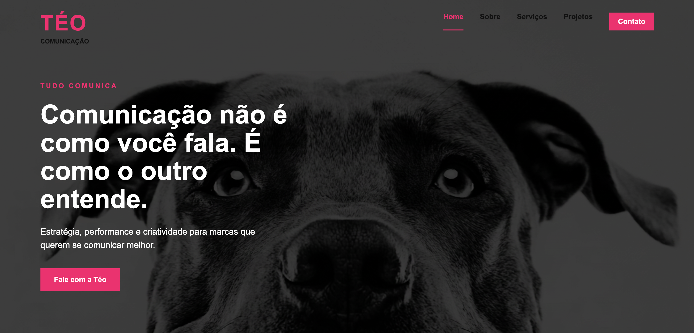
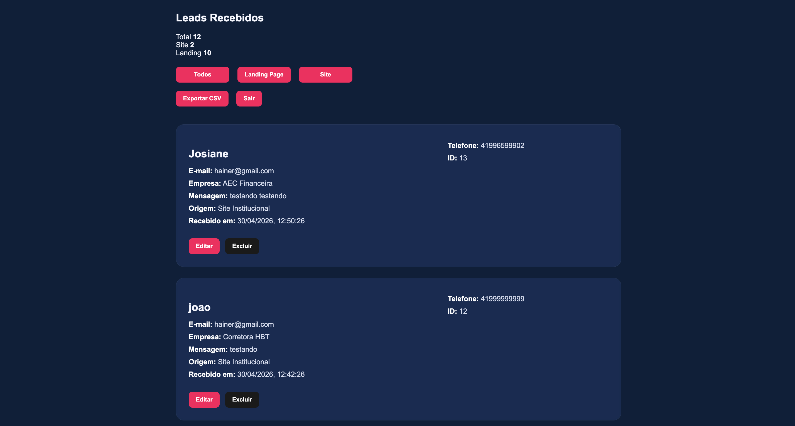

# 🚀 Téo Comunicação - Site Institucional + CRM de Leads

Projeto completo desenvolvido para a empresa **Téo Comunicação**, com foco em apresentação institucional e captação/gestão de leads.

---

## 🌐 Acessos

- 🔗 Site Institucional: https://teo-site-institucional.vercel.app/  
- 🔐 Painel Admin: https://teo-comunicacao-landing.vercel.app/admin.html  
- ⚙️ API: https://teo-backend-az8f.onrender.com  

---

## 📸 Preview

### 🖥️ Página Inicial



---

### 📊 Painel Administrativo



---

## 📌 Sobre o Projeto

Este projeto foi desenvolvido para unir:

- **Presença digital profissional (site institucional)**
- **Captação de leads**
- **Gestão completa via painel administrativo**

---

## 🎯 Funcionalidades

### 🌐 Site Institucional

- Página moderna e responsiva
- Seções:
  - Hero (impacto inicial)
  - Quem somos
  - Serviços
  - Projetos
  - Contato
- Botão de WhatsApp integrado
- Formulário conectado ao backend
- Navegação fluida entre seções

---

### 📥 Sistema de Leads

- Captura de dados via formulário
- Armazenamento em banco de dados
- Identificação da origem:
  - Site institucional
  - Landing page

---

### 🔐 Painel Administrativo

- Login protegido com JWT
- Listagem de leads
- Paginação
- Edição de leads
- Exclusão de leads
- Exportação em CSV
- Filtro por origem (Site / Landing)
- Contador de leads:
  - Total
  - Site
  - Landing

---

## 🛠️ Tecnologias Utilizadas

### Front-end
- HTML5
- CSS3
- JavaScript (Vanilla)

### Back-end
- Node.js
- Express
- PostgreSQL

### Segurança
- JWT (autenticação)
- Bcrypt (criptografia de senha)
- Helmet

### Deploy
- Front-end: Vercel
- Back-end: Render

---

## ⚙️ Estrutura do Projeto

```bash
frontend/
│
├── index.html
├── projetos.html
├── css/
│   └── style.css
├── js/
│   └── script.js
└── assets/
